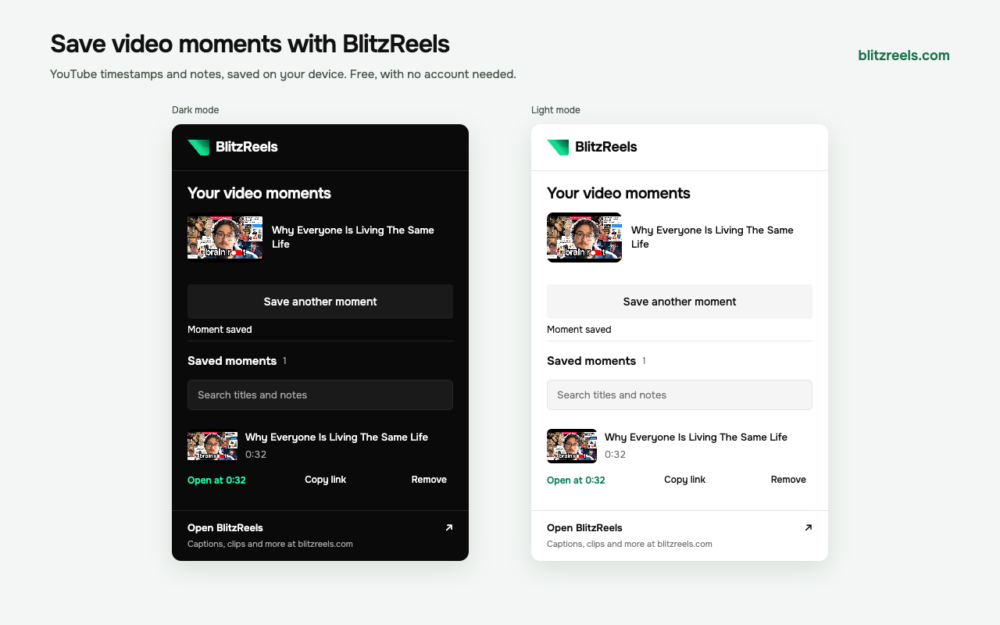

# BlitzReels - Save video moments

Save timestamps and notes while watching YouTube, then revisit them from a compact Chrome toolbar popup.
The extension is free and works without an account. The optional [BlitzReels](https://blitzreels.com) link opens the full web app.

## Install a release

Download and extract the ZIP from [GitHub Releases](https://github.com/blitzreels/chrome-extension/releases/latest).
In Chrome's Extensions page, enable Developer mode, choose **Load unpacked**, and select the extracted folder.
Refresh YouTube, then click **Save in BlitzReels** beneath a video or use the Chrome toolbar icon.

The Chrome Web Store listing has not been submitted yet. GitHub releases are available for manual installation.

## Use locally

1. Use Node.js 22.22.3 or newer and pnpm 12.3.4. Run `pnpm install --frozen-lockfile`, then `pnpm build`.
2. Load `dist` unpacked in Chrome's Extensions page, or reload the existing installation once.
3. Refresh YouTube and open a regular video or Short.
4. Click **Save in BlitzReels**, or open the toolbar icon.
5. Check the start time, add an optional end time and note, then click **Save moment**.
6. Search saved titles and notes, open a timestamp, copy a link, or remove a moment with Undo.

Chrome 127 or newer is required. The YouTube button returns after refreshes and SPA navigation.
A native popup closes when clicked outside; saved moments persist after it closes and after Chrome restarts.
Unsaved form text is not persisted. Uninstalling the extension removes its local library.
Ad playback, live streams, embedded players and mobile YouTube are unsupported.
If a video is still loading or playing an ad, wait and choose **Refresh video**.
An optional end time records a range; opening or copying a link starts the original video at the start time.
The extension does not stop playback at the end time or create a video file.

## Architecture

| Surface | Responsibility |
| --- | --- |
| `entrypoints` | WXT content script, worker and native popup bootstraps |
| `src/youtube` | Action placement, theme/lifecycle handling, on-demand playback metadata |
| `src/background` | Trusted local storage and serialized library mutations |
| `src/contracts.ts` | Runtime validation and typed message boundary |
| `src/moments.ts` | Time parsing, original-video links and search |
| `src/popup` | Composed form, searchable library, status and browser subscriptions |
| `src/components`, `src/design` | Shared BlitzReels logo, buttons and design tokens |
| `src/ui.showcase.tsx` | Actual view components supplied with explicit states |

Only the `storage` API permission is requested. The declarative content script runs on desktop YouTube domains.
Basic tab queries and messages target the active tab without reading arbitrary tab URLs or browser history.
The popup alone can read and change the library. The content script cannot access local extension storage.
Saved moments contain a canonical YouTube URL, video ID, title, start/end times, optional note, ID and creation time.
The library stores up to 1,000 moments. Identical saves are deduplicated; quota failures keep the existing library.
The extension removes obsolete local credentials and job caches from prototype versions during startup.

No clips, videos, audio, cookies, credentials or transcripts are extracted or recorded.
No backend processing, analytics, OAuth or remote executable code is included.
Thumbnails load directly from YouTube with no referrer. The optional app link includes campaign tags but no saved data.

## Check and package

- `pnpm verify`: typecheck, lint, unit tests, WXT build and browser checks.
- `pnpm exec playwright install chromium`: install the browser used by the automated checks.
- `pnpm preview`: component reference at localhost:3188. It is not the installed extension and contains no sample moments.
- `BLITZREELS_CHROMIUM_PATH`: choose an installed Chromium executable for browser checks.
- `node scripts/check-live-popup.mjs <youtube-url>`: unmodified build, real YouTube, native toolbar popup and persistence.
- `pnpm package`: verify, WXT ZIP and artifact validation; place a local candidate in `release`.

Fixtures test layout changes, message isolation, persistence, ranges, copy, search, removal, undo, themes and accessibility.
Only disposable profiles contain test data. The native check saves actual metadata from the supplied video.
Receipts live in `artifacts/verification.json` and `artifacts/live-popup-receipt.json`.

## Publication

[Listing and checklist](store/listing.md), [privacy policy](https://blitzreels-extension.vercel.app/privacy),
and [policy review](store/policy-review.md).
A local package does not create a public listing or backlink. Publication requires a developer account, a public privacy URL,
accurate store disclosures, screenshots from this version, and Google's review.
Archives under `artifacts/not-for-submission` contain the blocked extraction prototype and are not release candidates.
Those local archives are excluded from this repository and all releases.

Report a bug through [GitHub Issues](https://github.com/blitzreels/chrome-extension/issues).
For privacy questions, contact [support@blitzreels.com](mailto:support@blitzreels.com).
